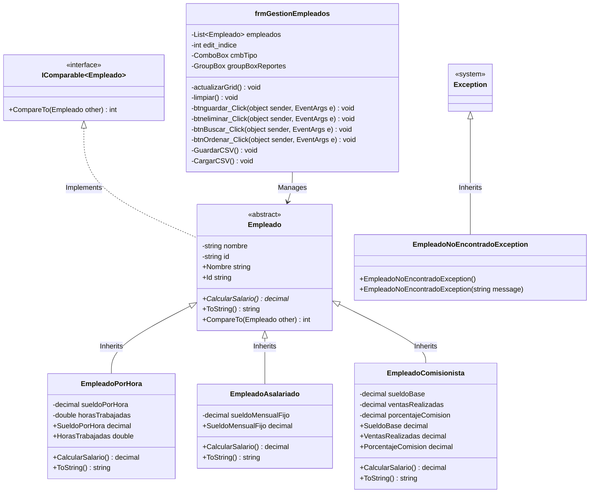

# Sistema de Gestión de Empleados con Herencia y Clases Abstractas

Este proyecto es una aplicación de escritorio desarrollada en C# utilizando Windows Forms. Permite gestionar una nómina de empleados de una empresa aplicando los conceptos fundamentales de la Programación Orientada a Objetos (POO): herencia, clases abstractas, polimorfismo y manejo de excepciones.

## Integrantes del Equipo
* Alexandra Elizabeth Alvarado Bautista  AB260167 
* Daniel Steven Palacios Flores PF260246 
* Douglas Emmanuel Sánchez Rivera SR260165
* Karla Angie Arias Pérez AP260403

---

## Jerarquía de Clases y Uso de Herencia

La arquitectura del sistema sigue un modelo orientado a objetos compuesto por:

1. **Clase Abstracta `Empleado`**:
   * Actúa como clase base.
   * Contiene los campos comunes (`id`, `nombre`) con sus respectivas validaciones públicas de lectura y escritura.
   * Define el método abstracto `CalcularSalario()`, obligando a todas las subclases a implementar su propia lógica de pago.
   * Implementa la interfaz `IComparable<Empleado>` para poder ordenar de forma automática una lista de empleados por su salario (de mayor a menor).
   * Sobrescribe el método virtual `ToString()` para formatear la salida común de datos.

2. **Clases Derivadas**:
   * **`EmpleadoPorHora`**: Representa a trabajadores remunerados según una tarifa horaria. Su salario se calcula como `SueldoPorHora * HorasTrabajadas`.
   * **`EmpleadoAsalariado`**: Empleados con salario mensual fijo. `CalcularSalario()` simplemente retorna este sueldo fijo.
   * **`EmpleadoComisionista`**: Empleados que cobran un sueldo base sumado a una comisión de ventas. Su salario es `SueldoBase + (VentasRealizadas * PorcentajeComision / 100)`.

---

## Diagrama de Clases UML (Mermaid)

El siguiente diagrama representa la estructura de clases del sistema. Puedes visualizarlo directamente en GitHub o copiar el código en [Mermaid Live Editor](https://mermaid.live) para exportarlo como PNG o JPG:



---

## Instrucciones para Ejecutar el Programa

1. **Requisitos**:
   * Tener instalado el SDK de .NET (.NET Core 8.0, 9.0 o 10.0).
   * Sistema operativo Windows (requerido para ejecutar la interfaz de Windows Forms).

2. **Compilación y Ejecución desde Consola**:
   * Abre la terminal de comandos (cmd o PowerShell) en el directorio raíz del proyecto.
   * Restaura y construye el proyecto ejecutando:
     ```bash
     dotnet build
     ```
   * Ejecuta la aplicación mediante:
     ```bash
     dotnet run
     ```

---

## Capturas de Pantalla de la Ejecución

A continuación se detallan los flujos demostrados en la ejecución de la aplicación:

### 1. Agregar Empleados
*Se ingresa un empleado de cada tipo (Por Hora, Asalariado, Comisionista) validando que los datos se ajusten y se deshabiliten los campos no aplicables según la selección.*


### 2. Calcular y Mostrar Salarios
*La tabla muestra de forma instantánea el tipo de empleado, su descripción mediante `ToString()` y el salario final calculado automáticamente.*


### 3. Buscar un Empleado por ID
*Uso de la función de búsqueda para cargar los detalles del empleado en los controles de edición.*


### 4. Lanzamiento y Captura de Excepción Personalizada
*Demostración de que si se intenta buscar o eliminar un ID inexistente, el programa lanza un error controlado por `EmpleadoNoEncontradoException` en un cuadro de diálogo sin colapsar.*


### 5. Guardar y Cargar desde CSV (Extra)
*Persistencia persistiendo los datos de la grilla en el archivo plano `empleados.csv` de manera transparente.*


