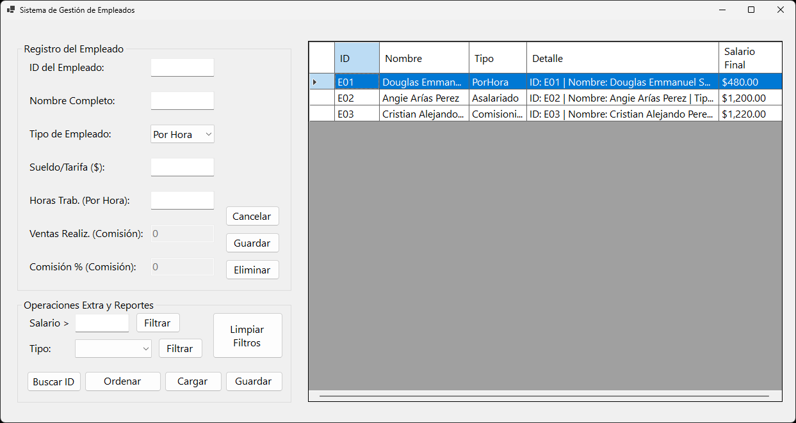
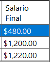
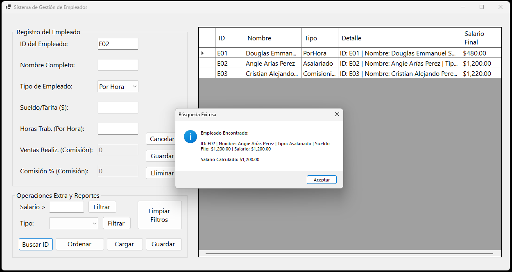
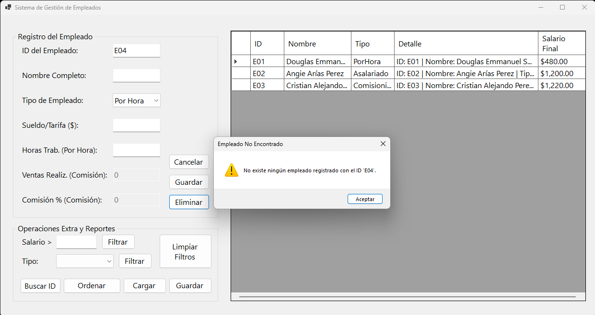
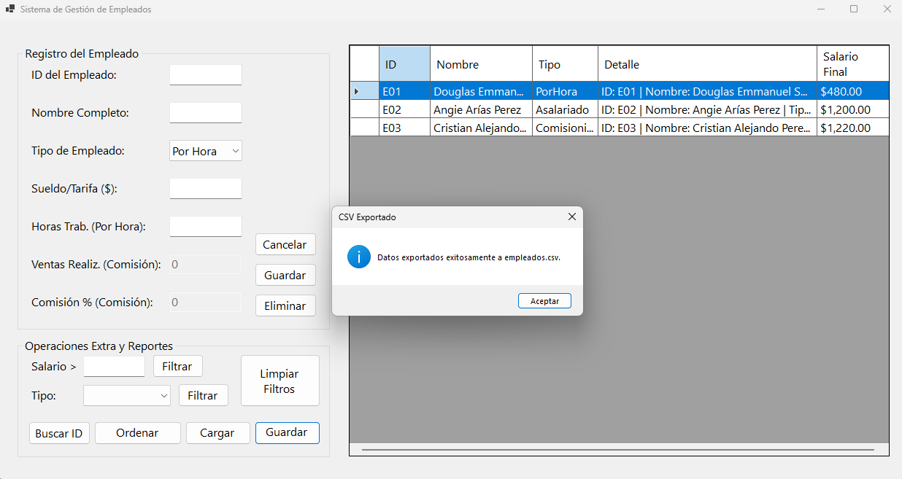

# Sistema de Gestión de Empleados

Proyecto de Windows Forms en C# para la gestión de nómina de empleados, enfocado en herencia, clases abstractas, polimorfismo y excepciones.

## Integrantes
* Alexandra Elizabeth Alvarado Bautista AB260167
* Daniel Steven Palacios Flores PF260246
* Douglas Emmanuel Sánchez Rivera SR260165
* Karla Angie Arias Pérez AP260403

## Justificación del uso de funciones flecha

El lenguaje C# incorpora la sintaxis de funciones flecha (=>) como una forma más concisa de expresar operaciones simples. En este proyecto se emplean dos usos diferentes de esta sintaxis:

### 1. Miembros con cuerpo de expresión
Se utilizan en los métodos de acceso (get) de las propiedades para simplificar la devolución del valor almacenado.

Ejemplo:
```csharp
public string Nombre
{
    get => nombre;
}
```

Esta sintaxis es equivalente a:
```csharp
public string Nombre
{
    get
    {
        return nombre;
    }
}
```

Su utilización reduce la cantidad de código sin modificar el funcionamiento del programa, mejorando la legibilidad y facilitando el mantenimiento.

### 2. Expresiones lambda
También se utilizan funciones flecha como expresiones lambda en operaciones realizadas sobre la colección de empleados mediante LINQ.

LINQ significa Language Integrated Query (Consulta Integrada al Lenguaje). Es una característica de C# que permite realizar consultas sobre colecciones de datos utilizando una sintaxis integrada en el propio lenguaje.

Algunos ejemplos presentes en el proyecto son:
* `Select()`, para proyectar la información que se muestra en el DataGridView.
* `Where()`, para filtrar empleados por salario o por tipo.
* `Any()`, para verificar si un ID ya existe.
* `FirstOrDefault()`, para localizar un empleado.
* `FindIndex()`, para obtener la posición de un empleado dentro de la lista.

Por ejemplo:
```csharp
empleados.Where(emp => emp.CalcularSalario() > salarioMinimo)
```

La expresión `emp => emp.CalcularSalario() > salarioMinimo` representa una función anónima que recibe un objeto Empleado y devuelve un valor booleano indicando si cumple la condición establecida.

El uso de expresiones lambda permite escribir consultas más claras, reducir la cantidad de código repetitivo y aprovechar las funcionalidades de LINQ para trabajar con colecciones de manera eficiente.

## Explicación de la jerarquía de clases y uso de herencia

El sistema fue diseñado siguiendo los principios de la Programación Orientada a Objetos, utilizando una jerarquía de clases que permite representar distintos tipos de empleados mediante herencia y polimorfismo.

La clase base del sistema es **Empleado**, declarada como una clase abstracta. Esta clase concentra los atributos y comportamientos comunes a todos los empleados, tales como:
* ID.
* Nombre.
* Constructor.
* Propiedades públicas.
* Método abstracto `CalcularSalario()`.
* Método `ToString()` sobrescrito para mostrar la información general del empleado.

Al ser una clase abstracta, **Empleado** no puede instanciarse directamente. Su propósito es servir como modelo para las clases especializadas.

A partir de ella se derivan tres clases:

### EmpleadoPorHora
Representa empleados cuyo salario depende de la cantidad de horas trabajadas y del pago por hora.

Su salario se calcula mediante:
`Salario = Sueldo por Hora * Horas Trabajadas`

### EmpleadoAsalariado
Representa empleados que reciben un sueldo mensual fijo.

Su salario corresponde directamente al sueldo establecido.

### EmpleadoComisionista
Representa empleados que reciben un sueldo base más una comisión sobre las ventas realizadas.

Su salario se calcula mediante:
`Salario = Sueldo Base + (Ventas * Porcentaje de Comisión / 100)`

Cada una incorpora únicamente los atributos específicos necesarios para calcular su salario.

## Uso de herencia

La herencia permite reutilizar el código común definido en la clase **Empleado**, evitando duplicar atributos y funcionalidades en cada tipo de empleado.

Gracias a ello:
* Todos los empleados poseen un ID y un nombre.
* Todos cuentan con un constructor común.
* Todos implementan el método `CalcularSalario()`.
* Todos sobrescriben el método `ToString()` para mostrar su información específica.

Esto facilita la incorporación de nuevos tipos de empleados en el futuro sin modificar el funcionamiento general del sistema.

Diagrama UML: https://drive.google.com/file/d/10kMwALbBlO8RtzPQ6u1iRXLh9jebLzdu/view

## Uso del polimorfismo

El programa almacena todos los empleados en una única colección:
```csharp
List<Empleado> empleados;
```

Aunque la lista contiene objetos de diferentes clases, todos son tratados como objetos de tipo **Empleado**.

Cuando el programa invoca:
```csharp
emp.CalcularSalario();
```
o
```csharp
emp.ToString();
```

el método ejecutado depende del tipo real del objeto almacenado, gracias al polimorfismo y al uso de métodos sobrescritos (`override`).

Esta característica permite recorrer la lista completa sin necesidad de conocer el tipo específico de cada empleado, simplificando el diseño del sistema y favoreciendo su extensibilidad.

En conjunto, la utilización de una clase abstracta, la herencia, el polimorfismo y las expresiones lambda permiten desarrollar un sistema modular, reutilizable, mantenible y alineado con las buenas prácticas de la Programación Orientada a Objetos en C#.

## Instrucciones de Ejecución

Requisitos: SDK de .NET y Windows.

Ejecutar en la consola:
```bash
dotnet build
dotnet run
```

## Capturas de Ejecución

### 1. Agregar Empleados
Ingreso de datos según tipo de empleado. Los campos no aplicables se deshabilitan.



### 2. Calcular y Mostrar Salarios
Visualización de empleados ordenados por salario y resultado en tabla.



### 3. Buscar Empleado
Carga de detalles a partir de un ID.



### 4. Excepciones
Mensaje de error controlado al buscar o eliminar ID inexistente.



### 5. Persistencia
Guardado y carga en archivo plano CSV.



